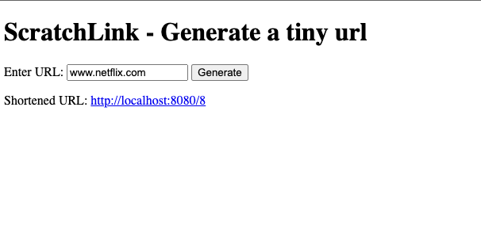

## ScratchLink 🗒️
A simple TinyURL generator. The backend is written in plain Java and the frontend is just html and vanilla JS. 

The server listens to TCP connections form client in order to generate the URL, it can also accept concurrent connections ;) We use a POST request method to generate the tiny URL from the original URL and a GET request which re-directs the user to the original URL when requesting for the tiny URL. 

The tiny URL is generated by maintaing counter that is shared across the request handler threads. The counter is increemented per tiny url request and then it is base62 encoded. The base62 encoded string is stored to disk and returned the user. 

In order for efficient retrieval and storage of the "tinified" URL, we use a B tree where each key points to the path of the file which contains the URL. The file is padded to 4096 bytes (hardcoded block size) and flushed to disk

### How to run it ?
```bash
git clone https://github.com/grohith327/ScratchLink.git
cd ScratchLink

# if you are on macos
javac Server.java && java Server && open index.html

# if you are on linux
javac Server.java && java Server && xdg-open index.html 
```

